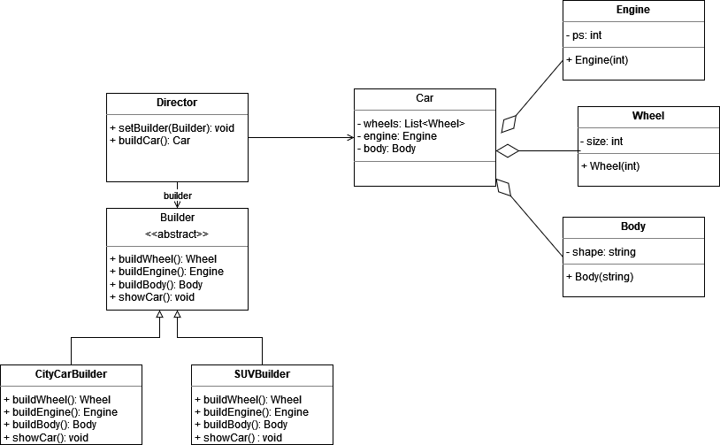

# Task
Complete the code implementing the builder pattern regarding the creation of cars.

- see TODOs in source code
- see also illustration below
- In the exercise the methods `showCar` are substituted by method `Car.display`.

