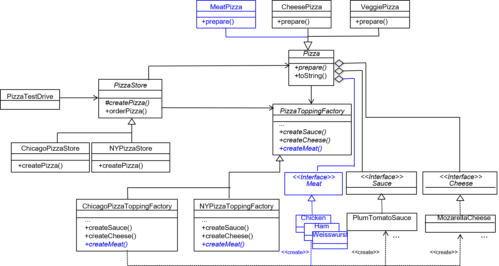

# Task
Extend the existing code of the pizza store in order to allow the creation of meat pizzas.

- see TODOs in source code
- see also illustration below
- The existing code can be compiled and run.

